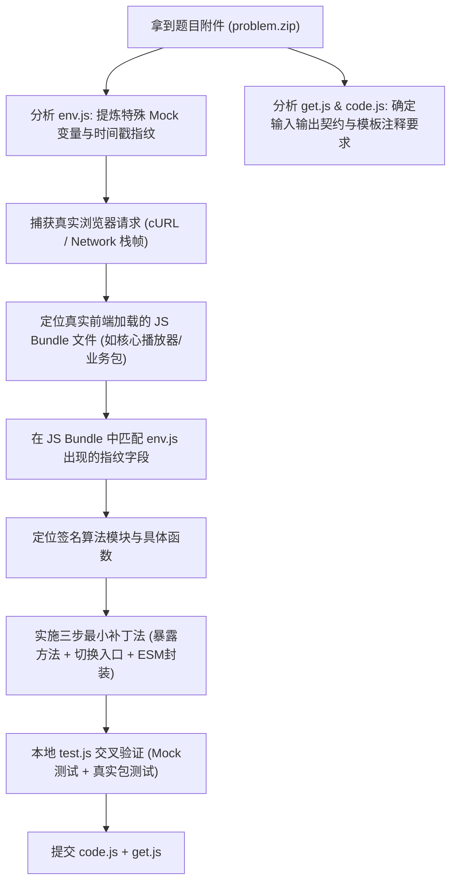

# Handoff: Web 前端逆向与签名算法题目解题经验（以 GeekPie 2026 为例）

## 1. 任务背景与整体概况 (Task Context)
- **题目类型**：CTF / 算法逆向与工程重构题（Web 前端签名逆向）。
- **目标接口**：Bilibili 视频播放心跳上报接口 (`https://api.bilibili.com/x/click-interface/web/heartbeat`) 的 `w_rid` (WBI) 签名生成算法。
- **题目附件结构**：
  - `env.js`：评测/测试环境 Mock 脚本（模拟 Node.js 下的浏览器全局对象与固定时间戳，平台会替换为评测用 `env.js`，参赛者**不得修改**）。
  - `get.js`：评测入口函数，导入 `code.js` 并执行 `wbiSign({ ...globalThis.WBI_PARAMS }, img, sub).w_rid`。
  - `code.js`：待补全提交的签名模块。初始注释明确提示：`// 此处完整复制你逆向得到的代码文件，仅添加必要的修改`。
- **提交约束**：仅提交 `code.js` 与 `get.js`，线上评测平台在独立沙箱执行并比对输出结果。

---

## 2. 核心经验复盘：如何精准理解出题人意图与题目架构

在解决此类逆向代码重构题目时，解题者极易陷入**“纯算法白盒重写”**的误区，即从公开文档或算法库手写一套干净的 MD5 和加签逻辑。然而在线评测频繁未通过，最终通过作者提示发现破题关键在于**“逆向补丁法（Patching Bundled Source）”**。

### 经验 1：从 `env.js` 的 Mock 变量反推目标环境与代码原型
出题人在 `env.js` 中提供的 mock 并非随意的，每一行都暴露了出题人测试代码时遇到的异常：
- `document.baseURI = "https://www.bilibili.com/"`
- `location.href = "https://www.bilibili.com/"`
  - **原型定位**：Webpack 5 运行时解析 chunk 路径的代码：`__webpack_require__.b = document.baseURI || self.location.href;`。
- `Object.defineProperty(navigator, { value: { product: "ReactNative", userAgent: "node" } })`
  - **原型定位**：打包进 Webpack 的 Axios/HTTP 客户端环境嗅探函数：
    `isStandardBrowserEnv: function() { return !("ReactNative" === navigator.product ...) }`。出题人将其设置为 `ReactNative`，正是为了阻止 Axios 在 Node 环境下因找不到浏览器的 `XMLHttpRequest` 而崩溃。
- **启示**：在下一道同类型题目中，**首先通读 `env.js`，将里面所有的 mock 字段当作指纹（Fingerprints）**，在目标网站的 JS Bundle 中全局搜索。凡是命中这些指纹的代码段，必然是出题人直接运行或抽取的源码！

### 经验 2：从真实流量（抓包）比对隐藏字段与特化参数
通用文档（如社区文档、WBI 通用教程）只记录常规 API（如搜索、用户信息接口），但具体题目的特定 API（如心跳上报）往往存在内部特化处理：
- 在通用 WBI 签名中，参与 MD5 计算的仅是入参字典 + `wts` + `mixin_key`。
- 但在 B 站官方播放器核心包 `core.ba67b466.js` 的模块 `57356` 中，心跳签名函数第一句强制执行：
  ```javascript
  n.web_location = 1315873;
  ```
- 出题人评测环境的 `WBI_PARAMS` 并未显式提供 `web_location`。纯算法重写若未加入此自动注入，MD5 哈希值必然不匹配；而原版混淆函数自带有该逻辑。
- **启示**：遇到特定 API，务必让用户或自己通过浏览器 DevTools 抓包真实网络请求，将 URL 参数与代码内存参数逐字段对齐，找出隐蔽注入的默认字段。

###经验 3：出题人的“原样复制源码 + 最小必要修改”打补丁规范
出题人明确要求：“在 code 里贴上完整的逆向源代码，仅作很少的修改，导出给 get”。
对于复杂的 Webpack 打包大型 JS（如 2MB 的核心播放器包），如何做到“仅改 3 处”优雅导出：

1. **定位签名核心函数**：在混淆代码中搜索 WBI 关键特征（如重排表 `[46, 47, 18, 2, ...]` 或默认 fallback 密钥）。找到函数 `I(n, r, i)`，其入参完全契合 `(params, img_url, sub_url)`。
2. **打补丁 1：模块内部导出**：
   找到该模块定义（如 `57356`）顶部的 Webpack 导出语句：
   ```javascript
   // 修改前
   i.d(r, { lw: function() { return r7 }, j$: function() { return r5 } });
   // 修改后：追加 wbiSign
   i.d(r, { lw: function() { return r7 }, j$: function() { return r5 }, wbiSign: function() { return I } });
   ```
3. **打补丁 2：入口劫持**：
   将 Webpack 整体执行完毕后 return 的主入口（默认通常是渲染 UI 的模块，会在 Node 下因缺少 DOM API 报错）替换为签名模块：
   ```javascript
   // 修改前
   var __webpack_exports__ = __webpack_require__(95866); return __webpack_exports__;
   // 修改后
   var __webpack_exports__ = __webpack_require__(57356); return __webpack_exports__;
   ```
4. **打补丁 3：环境兜底与 ESM 导出封装**：
   在文件头尾增加 ESM 适配，确保与 `get.js` 的 `import code from "./code.js"; const { wbiSign } = code;` 100% 兼容：
   ```javascript
   // 头部：防止纯 Node 环境缺少全局变量
   if (typeof self === "undefined") globalThis.self = globalThis;
   if (typeof window === "undefined") globalThis.window = globalThis;
   var module = { exports: {} };
   var exports = module.exports;

   // [此处放置 2MB 的完整官方混淆 bundle 代码]

   // 尾部：统一默认导出与命名导出
   export default module.exports;
   export const wbiSign = module.exports.wbiSign;
   ```

---

## 3. 下一道同类题目的标准化作业流程 (SOP for Next Challenge)



1. **审题阶段**：
   - 检查 `env.js` 的所有 mock。如果 mock 了特定 DOM/BOM 属性，说明题目的预期解法就是“塞入完整/大段混淆 bundle”。
   - 检查 `get.js` 如何 import `code.js`，参数类型是原始类型还是对象，是否解构。
2. **逆向定位阶段**：
   - 从用户处获取浏览器真实请求的 cURL 及 Initiator 调用栈。
   - 下载对应的生产 JS bundle。
   - 使用文本搜索定位签名算法及所在 Webpack module ID。
3. **补丁与验证阶段**：
   - 优先使用脚本（如 `fs.readFileSync` + `replace`）自动生成补丁文件，避免因手工编辑大文件导致语法损坏。
   - 编写 `test.js`，包含两组测试用例：
     1. 基于 `env.js` 的本地基准测试（如已知预期输出）。
     2. 真实抓包参数与时间戳签名还原验证。
4. **敏感信息脱敏**：
   - 任何涉及用户身份凭据（如 `SESSDATA`, `bili_jct`, `bili_ticket`, Cookie 等）必须替换为通用占位符，严禁明文入库。

